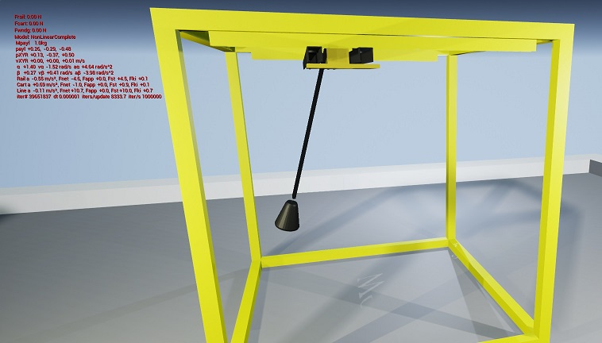

# CraneVR - Sample project using Crane3dPlugin

This is a reference project which uses INTECO 3DCrane simulation plugin [Crane3dPlugin](https://github.com/RedFox20/Crane3dPlugin). It only implements basic control of the 3D Crane. The plugin repository is added as a GIT submodule.

For more details, reference the [Crane3dPlugin](https://github.com/RedFox20/Crane3dPlugin) README.

